# Comparative Analysis of DQN and Double DQN Agents in the LunarLander Environment

## Index
1. [Overview](#overview)
2. [Environment](#environment)
3. [Networks](#networks)
    - [DQN](#dqn-deep-q-network)
    - [DDQN](#ddqn-double-deep-q-network)
4. [Hyperparameters](#hyperparameters)
5. [Seeding Strategy](#seeding-strategy)
6. [Results](#results)
    - [Visual Demonstration of Agent Performance](#visual-demonstration-of-agent-performance)
    - [Analysis of DQN and Double DQN Performance](#analysis-of-dqn-and-double-dqn-performance)
    - [Learning Curves](#learning-curves)
    - [Rolling Averages](#rolling-averages)
    - [Kernel Density Estimate](#kernel-density-estimate)
    - [Comparison of Networks at Solving Point](#comparison-of-networks-at-solving-point)
    - [Comparison of Networks after Full Training (4000 Episodes)](#comparison-of-networks-after-full-training-4000-episodes)
7. [Discussion](#discussion)
8. [References](#references)
9. [Setup Instructions](#setup-instructions)
    - [Prerequisites](#prerequisites)
    - [Steps to Set Up the Environment](#steps-to-set-up-the-environment)
    - [Using the Environment](#using-the-environment)
10. [Troubleshooting](#troubleshooting)

## Overview
In this project, I demonstrate the implementation and evaluation of Deep Q-Learning (DQN) and Double Deep Q-Learning (Double DQN) algorithms to solve the Lunar Lander environment from Gymnasium. The Lunar Lander environment is a popular exercise for testing reinforcement learning algorithms, where the goal is to land a spacecraft safely on the moon's surface. You can find more details about this environment [here](https://gymnasium.farama.org/environments/box2d/lunar_lander/).

The comparison between DQN and Double DQN is particularly interesting and important for several reasons:

1. It demonstrates how a relatively simple modification to the DQN algorithm (as implemented in Double DQN) can potentially lead to significant improvements in learning efficiency and stability.
2. The comparison helps in understanding the impact of overestimation bias in Q-learning and how it can be mitigated.

By implementing and comparing these two algorithms in the Lunar Lander environment, I aim to provide a clear understanding of their relative strengths and weaknesses, as well as practical insights into their application in reinforcement learning tasks.
## Environment

The Lunar Lander environment in Gymnasium is a simulation where the goal is to land a spacecraft safely on the moon's surface. The environment provides a continuous state space with eight dimensions, which describe the position, velocity, angle, and angular velocity of the lander, as well as two Boolean flags indicating whether each leg is in contact with the ground.

### Actions
The environment allows four discrete actions:
1. Do nothing
2. Fire left engine
3. Fire main engine
4. Fire right engine

### Rewards
Rewards are given based on the following criteria:
- Moving from the top of the screen to the landing pad and coming to rest is about 100-140 points.
- If the lander moves away from the landing pad, it loses reward.
- The lander receives an additional reward for landing with its legs touching the ground.
- Firing the main engine costs -0.3 points each frame.
- Firing the side engines costs -0.03 points each frame.
- The game is solved if you achieve 200 points.
## Networks

```mermaid
graph TD
    subgraph DDQN
        DD_S[State] --> DD_LN[Local Network]
        DD_LN -->|Q-values| DD_MQ[Max Q-value Selection]
        DD_MQ -->|Action Selection| DD_AS[Selected Action]
        DD_S --> DD_TN[Target Network]
        DD_LN -->|Next State Q-values| DD_NQ[Next Action Selection]
        DD_NQ --> DD_TN
        DD_TN -->|Q-value Evaluation| DD_QE[Q-value of Selected Action]
        DD_QE -->|Target Q-value| DD_L[Loss Computation]
        DD_LN -->|Current Q-value| DD_L
        DD_L --> DD_U[Update Local Network]
        DD_U -->|Soft Update| DD_TN
    end

    subgraph DQN
        D_S[State] --> D_LN[Local Network]
        D_LN -->|Q-values| D_MQ[Max Q-value Selection]
        D_MQ -->|Action Selection| D_SA[Selected Action]
        D_S --> D_TN[Target Network]
        D_TN -->|Next State Max Q-value| D_TQ[Target Q-value]
        D_TQ --> D_L[Loss Computation]
        D_LN -->|Current Q-value| D_L
        D_L --> D_U[Update Local Network]
        D_U -->|Soft Update| D_TN
    end

    classDef highlight fill:#ff7f0e,stroke:#333,stroke-width:2px;
    class D_MQ,D_SA,DD_MQ,DD_AS,DD_NQ,DD_QE highlight;
```

### DQN (Deep Q-Network)
Deep Q-Learning (DQN) is an algorithm that approximates the Q-value function using a deep neural network. The Q-value function represents the expected future rewards for an agent taking an action in a given state. The DQN algorithm uses the following key components:
- **Experience Replay:** Stores agent experiences (state, action, reward, next state) during training and samples random batches for training the network.
- **Target Network:** A separate network used to calculate target Q-values, which helps to stabilize training.

#### Formula
The Q-learning update rule:

$Q(s_t, a_t) \leftarrow Q(s_t, a_t) + \alpha [ r_{t+1} + \gamma \max_{a'} Q(s_{t+1}, a') - Q(s_t, a_t)]$

In DQN, the loss function to minimize:

$L(\theta) = \mathbb{E}_{(s_t, a_t, r_{t+1}, s_{t+1}) \sim \text{Replay Buffer}} \left[ \left( r_{t+1} + \gamma \max_{a'} Q_{\theta^-}(s_{t+1}, a') - Q_\theta(s_t, a_t) \right)^2 \right]$

Where:
- $s_t$: Current state at time t
- $a_t$: Action taken at time t
- $r_{t+1}$: Reward received after taking action $a_t$ in state $s_t$
- $s_{t+1}$: Next state after taking action $a_t$ in state $s_t$
- $Q(s_t, a_t)$: Q-value for taking action $a_t$ in state $s_t$
- $\alpha$: Learning rate
- $\gamma$: Discount factor for future rewards (0 < $\gamma$ ≤ 1)
- $\theta$: Parameters of the online Q-network
- $\theta^-$: Parameters of the target Q-network
- $\mathbb{E}$: Expected value
- $\text{Replay Buffer}$: Storage of past experiences (state, action, reward, next state)

### DDQN (Double Deep Q-Network)
Double Deep Q-Learning (DDQN) addresses the overestimation bias of Q-learning by decoupling the action selection from the target Q-value generation. The algorithm selects the action using the online network and evaluates it using the target network.

#### Formula
The DDQN update rule:

$Q(s_t, a_t) \leftarrow Q(s_t, a_t) + \alpha \left[ r_{t+1} + \gamma Q(s_{t+1}, \arg\max_{a'} Q(s_{t+1}, a')) - Q(s_t, a_t) \right]$

In DDQN, the loss function to minimize:

$L(\theta) = \mathbb{E}_{(s_t, a_t, r_{t+1}, s_{t+1}) \sim \text{Replay Buffer}} \left[ \left( r_{t+1} + \gamma Q_{\theta^-}(s_{t+1}, \arg\max_{a'} Q_\theta(s_{t+1}, a')) - Q_\theta(s_t, a_t) \right)^2 \right]$

Where:
- All variables are the same as in DQN
- $Q_\theta$: Q-values from the online network (used for action selection)
- $Q_{\theta^-}$: Q-values from the target network (used for action evaluation)

### Key Differences
1. In DQN, both action selection and evaluation for the next state are performed using the target network ($Q_{\theta^-}$).
2. In DDQN, action selection for the next state is done using the online network ($Q_\theta$), while the evaluation uses the target network ($Q_{\theta^-}$).
3. This decoupling in DDQN helps to reduce the overestimation bias present in the original DQN algorithm.

Both algorithms use experience replay to break correlations between consecutive samples and improve learning stability. The target network, updated less frequently than the online network, provides a stable target for learning, crucial for both DQN and DDQN.
## Hyperparameters

Hyperparameters are critical for the performance of deep reinforcement learning algorithms. Here are the key hyperparameters used in this project and their chosen values:

- **Learning Rate (α)**: The rate at which the network updates its weights. For this project, I chose a learning rate of 0.0005.
  - *Impact*: A smaller learning rate can lead to more stable learning but slower convergence, while a larger rate might lead to faster learning but potential instability.

- **Discount Factor (γ)**: The discount factor for future rewards. I used (γ = 0.99).
  - *Impact*: A value close to 1 means the agent considers future rewards almost as important as immediate rewards, encouraging long-term planning.

- **Batch Size**: The number of experiences sampled from the replay buffer for each update. I used a batch size of 100.
  - *Impact*: Larger batch sizes can lead to more stable updates but require more computation per step.

- **Replay Buffer Size**: The maximum number of experiences stored in the replay buffer. I set this to 100,000.
  - *Impact*: A larger buffer allows for more diverse sampling but requires more memory.

- **Target Network Update Frequency**: The frequency (in steps) at which the target network is updated to match the online network. I updated the target network every 1,000 steps.
  - *Impact*: Less frequent updates provide more stable target Q-values but might slow down learning.

- **Epsilon (ε)**: The exploration rate for the epsilon-greedy policy. I used an initial value of 1.0, decayed it by 0.995 each episode, and set a minimum value of 0.01.
  - *Impact*: This balance between exploration and exploitation is crucial for discovering optimal policies.

- **Soft Update Parameter (τ)**: The interpolation parameter used for soft updates of the target network.
  - *Current setting*: τ = 0.001
  - *Impact*: Controls how quickly the target network tracks the online network. A smaller value leads to slower, more stable updates, while a larger value allows the target network to more quickly adapt to changes in the online network.

- **Update Frequency**: How often (in terms of steps) the soft update is performed.
  - *Current setting*: Every 4 steps (based on typical DQN implementations)
  - *Impact*: More frequent updates allow the target network to track the online network more closely, potentially speeding up learning but possibly at the cost of stability.

Additional hyperparameters to consider:

- **Network Architecture**: The structure of the neural network, including the number of layers and neurons per layer.
  - *Current setting*: Two hidden layers with 64 neurons each.
  - *Impact*: The network's capacity to represent complex Q-functions.

- **Optimizer**: The optimization algorithm used to update the network weights.
  - *Current setting*: Adam optimizer.
  - *Impact*: Different optimizers can affect the speed and stability of learning.

- **Activation Function**: The non-linear function applied after each layer.
  - *Current setting*: ReLU (Rectified Linear Unit).
  - *Impact*: Affects the network's ability to learn complex patterns.

These hyperparameters were chosen based on empirical testing and common practices in deep reinforcement learning. Fine-tuning these parameters can significantly impact the agent's learning performance and stability.
## Seeding Strategy

To ensure reproducibility and fair comparison between the DQN and Double DQN algorithms, this project implements a seeding strategy:

1. **Base Seed**: A base seed is set for each experiment. This seed is used as the starting point for all runs in the experiment.

2. **Multiple Runs**: For each algorithm (DQN and Double DQN), multiple training runs are performed. Each run uses a unique seed derived from the base seed:
   ```python
   current_seed = base_seed + run_number
   ```

3. **Global Seeding**: At the start of each run, a global seed is set using the `set_seed` function. This seeds Python's random module, NumPy, PyTorch, and CUDA for comprehensive reproducibility:
   ```python
   set_seed(current_seed)
   ```

4. **Agent Seeding**: Each agent (DQN or Double DQN) is initialized with the current seed, affecting network weight initialization and replay buffer sampling.

5. **Environment Reset**: The environment is reset at the start of each episode without explicitly setting a seed:
   ```python
   state, _ = env.reset()
   ```

This seeding approach ensures that:
- Each run of the training process is unique but reproducible.
- The global random state is consistent across runs, affecting all random processes in the system.
- The training process balances the need for reproducibility with the benefits of diverse experiences.

By using this seeding strategy, I can ensure fair comparisons between algorithms and reproducibility of results across different executions of the experiment, while still allowing for the variability necessary for robust reinforcement learning.
## Results

In this analysis, I compare the performance of DQN and Double DQN algorithms in the Lunar Lander environment through several complementary approaches:

1. **Visual Demonstration**: Video examples of the agents' performance without any training and after training each of the two networks are shown as examples of the game. 
2. **Learning Curves**: The average reward over episodes aids in understanding the learning speed and stability of each algorithm.
3. **Rolling Averages**: This analysis provides insight into the consistency of performance across multiple runs.
4. **Kernel Density Estimate**: Is used to visualize the overall distribution of rewards, highlighting the algorithms' tendency to achieve high scores.
5. **Performance at Solving Point**: The algorithms' behaviors are compared immediately after they solve the environment.
6. **Performance after Full Training**: Here both algorithms are compared in terms of performance after extended training.

Each of these analyses contributes to a comprehensive understanding of the strengths and weaknesses of DQN and Double DQN in this specific task. As we progress through these results, we'll see how Double DQN's design modifications impact its performance relative to the standard DQN algorithm.

### Visual Demonstration of Agent Performance

To provide a clear visual understanding of how the agents perform, I present three video examples:

#### Untrained Network (Random Actions):
This video demonstrates the performance of an untrained agent, which essentially takes random actions. As expected, the spacecraft crashes without any controlled landing attempt.

<video width="320" height="240" controls>
  <source src="outputs/random_actions.mp4" type="video/mp4">
  Your browser does not support the video tag.
</video>

#### Trained Deep Q-Network (DQN) Model:
This video shows a successful landing achieved by a fully trained DQN agent. Notice the controlled descent and landing maneuvers.

<video width="320" height="240" controls>
  <source src="outputs/trained_dqn.mp4" type="video/mp4">
  Your browser does not support the video tag.
</video>

#### Trained Double Deep Q-Network (DDQN) Model:
Similarly, this video demonstrates a successful landing by a fully trained DDQN agent. 

<video width="320" height="240" controls>
  <source src="outputs/trained_ddqn.mp4" type="video/mp4">
  Your browser does not support the video tag.
</video>

These visual examples provide context for the quantitative analyses that follow, illustrating the dramatic improvement in performance from untrained to trained agents.

### Analysis of DQN and Double DQN Performance

I will now analyze the performance of DQN and Double DQN algorithms based on several sets of quantitative data: learning curves, rolling averages, kernel density estimates, and comparisons at different training stages.

### Learning Curves

The learning curves compare the performance of DQN and Double DQN algorithms over 4000 episodes, averaged across 5 runs. This visualization helps to understand how quickly each algorithm learns and how stable their performance is over time.

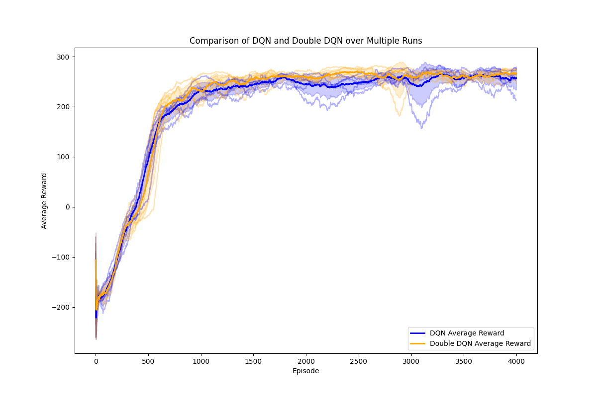

#### Comparison Methodology:
- Both DQN and Double DQN were trained on identical sets of Lunar Lander environments.
- For each run, the same random seed was used for both algorithms, ensuring they faced the exact same sequence of initial states and environment dynamics.
- This approach allows for a fair, direct comparison between the two algorithms.

#### Key Insights:

1. **Initial Learning Phase (0-250 episodes)**: 
   - Both algorithms start with negative rewards, showing high variability as they explore the environment.

2. **Rapid Improvement (250-1000 episodes)**:
   - Sharp increase in average rewards for both algorithms.
   - Double DQN begins to outperform DQN slightly.

3. **Convergence (1000-4000 episodes)**:
   - Both algorithms stabilize, with Double DQN maintaining a higher average reward.
   - Narrowing shaded regions indicate increased consistency in performance.

4. **Overall Performance**:
   - Double DQN consistently shows slightly better performance than DQN.
   - Both algorithms demonstrate effective learning, reaching and maintaining positive average rewards.

5. **Stability**:
   - Double DQN exhibits slightly narrower shaded regions, suggesting more consistent performance across runs.

6. **Solving the Environment**:
   - In all 5 runs, Double DQN consistently solved the environment (achieved an average score of 200+ over 100 consecutive episodes) before DQN.
   - The faster solving time of Double DQN suggests it's more sample-efficient, learning effective policies quicker than standard DQN.

#### DDQN's Consistent Advantage:
The consistent outperformance of Double DQN across all runs is likely due to its ability to reduce overestimation bias in Q-value estimates. This leads to:
- More accurate value estimations
- Better policy decisions
- Faster convergence to optimal policies
- Improved stability during learning

In conclusion, while both algorithms successfully learn to solve the Lunar Lander environment, Double DQN shows a clear and consistent advantage in terms of learning speed, final performance, and learning stability. This advantage is maintained across multiple runs with different random seeds, underlining the robustness of Double DQN's improved learning mechanism.

### Rolling Averages

The rolling averages plot compares the performance stability of DQN and Double DQN algorithms across 5 independent runs, each lasting 4000 episodes. This visualization helps to understand the consistency and learning patterns of each algorithm.

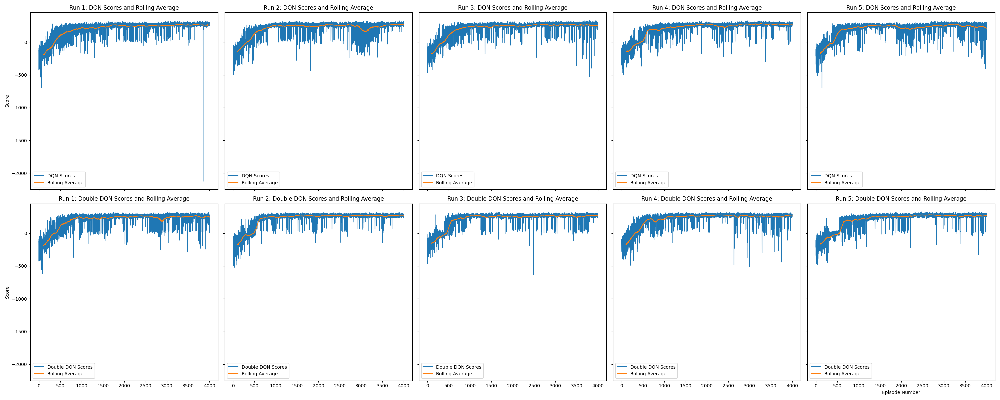

#### Comparison Methodology:
- Each row represents one algorithm: DQN (top) and Double DQN (bottom).
- Each column represents a separate run with a unique random seed.
- Blue lines show raw episode scores; orange lines show 100-episode rolling averages.
- Identical random seeds were used for corresponding DQN and Double DQN runs, ensuring fair comparison.

#### Key Insights:

1. **Learning Progress**:
   - Both algorithms show clear learning progress, transitioning from negative to positive scores.
   - Double DQN consistently achieves positive scores faster than DQN across all runs.

2. **Stability**:
   - Double DQN exhibits smoother rolling averages, indicating more stable learning.
   - DQN shows higher volatility, particularly in the early and mid stages of training.

3. **Performance Ceiling**:
   - Double DQN reaches and maintains higher peak performance in most runs.
   - DQN's performance plateaus at a slightly lower level compared to Double DQN.

4. **Consistency Across Runs**:
   - Double DQN shows more consistent performance patterns across all 5 runs.
   - DQN exhibits more variability between runs, suggesting higher sensitivity to initial conditions.

5. **Convergence Speed**:
   - Double DQN typically converges to stable performance faster than DQN.
   - This faster convergence is evident in all runs, highlighting Double DQN's sample efficiency.

6. **Late-Stage Stability**:
   - Both algorithms show increased stability in later episodes (3000-4000).
   - Double DQN maintains a higher and more consistent performance level in this stage.

#### Double DQN's Advantages:
The consistent superior performance of Double DQN across all runs can be attributed to:
- Reduced overestimation bias in Q-value estimates
- More accurate action-value estimations leading to better policy decisions
- Improved stability during the learning process

In conclusion, while both algorithms successfully learn to solve the Lunar Lander environment, Double DQN demonstrates clear advantages in learning speed, stability, and final performance. These benefits are consistently observed across multiple runs with different random seeds, underlining the robustness of Double DQN's improved learning mechanism in this environment.

### Kernel Density Estimate

The Kernel Density Estimate (KDE) plot provides a comprehensive view of score distributions for DQN and Double DQN algorithms across all runs and episodes. This visualization helps to understand the overall performance characteristics and consistency of each algorithm.

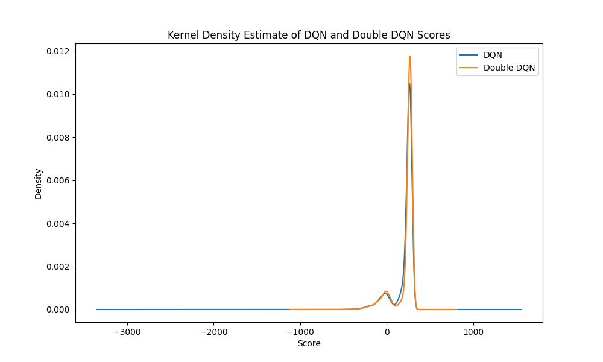

#### Comparison Methodology:
- The plot combines scores from all 5 runs and 4000 episodes for each algorithm.
- DQN is represented by the blue curve, Double DQN by the orange curve.
- The x-axis shows the reward scores, while the y-axis represents the probability density.
- Higher density at a particular score indicates more frequent occurrence of that score.

#### Key Insights:

1. **Performance Peaks**:
   - Both algorithms show a primary peak around a score of 250, indicating frequent high performance.
   - Double DQN's peak is slightly higher and narrower, suggesting more consistent high scores.

2. **Score Distribution**:
   - Double DQN's distribution is more concentrated around high scores, indicating better overall performance.
   - DQN shows a slightly wider distribution, suggesting more variability in performance.

3. **Low Score Occurrences**:
   - Both algorithms have a secondary peak near 0, representing early learning stages or challenging episodes.
   - The negative score tails are thin for both, indicating infrequent poor performances.

4. **Consistency**:
   - Double DQN's narrower primary peak suggests more stable performance across episodes and runs.
   - DQN's slightly wider distribution indicates more variability in its performance.

5. **Learning Efficiency**:
   - Double DQN's more pronounced peak at high scores suggests it might learn more efficiently, spending more episodes at peak performance.

#### Double DQN's Advantages:
The KDE plot highlights several advantages of Double DQN:
- More consistent high-score performance
- Potentially faster learning, as indicated by the higher density at peak scores
- Slightly better overall performance, with a higher concentration of scores in the upper range

These advantages align with Double DQN's design to reduce overestimation bias, leading to more accurate Q-value estimates and, consequently, more stable and effective learning.

In conclusion, while both algorithms show strong performance in solving the Lunar Lander environment, the KDE plot reveals that Double DQN achieves slightly better and more consistent results. This analysis complements the previous learning curves and rolling averages, providing a holistic view of the algorithms' performance characteristics across all episodes and runs.

### Comparison of Networks at Solving Point

After both networks solved the environment (achieved an average score >200 over 100 episodes), I compared their performances over 1000 test episodes. This analysis provides insights into their stability and effectiveness immediately after reaching the solving threshold. 

**Important Test Conditions:**
- Exploration was set to zero (ε = 0)
- Only the greedy action was selected for each state
- The test ran for 1000 episodes

These conditions allow us to evaluate the true learned policy of each network without the influence of random exploratory actions. By using only greedy actions, we can assess how well each network has learned to make optimal decisions in the Lunar Lander environment.

#### Rolling Average Rewards
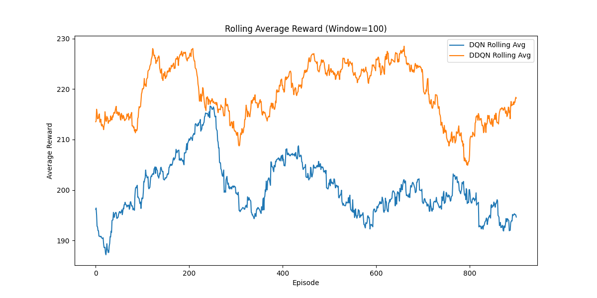

**Key Insights:**
- Double DQN consistently outperforms DQN throughout the test period.
- DQN frequently drops below the 200 reward threshold, which would indicate losing the "solved" status at times.
- Both algorithms show fluctuations, but Double DQN demonstrates more stable performance overall.


#### Cumulative Rewards
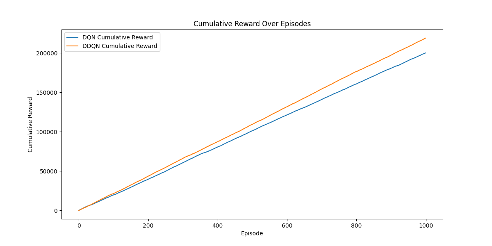

**Key Insights:**
- Both algorithms show steady accumulation of rewards.
- Double DQN accumulates rewards at a faster rate, indicating higher per-episode rewards.
- The performance gap widens over time, showcasing Double DQN's superior consistency.

#### Per-Episode Rewards
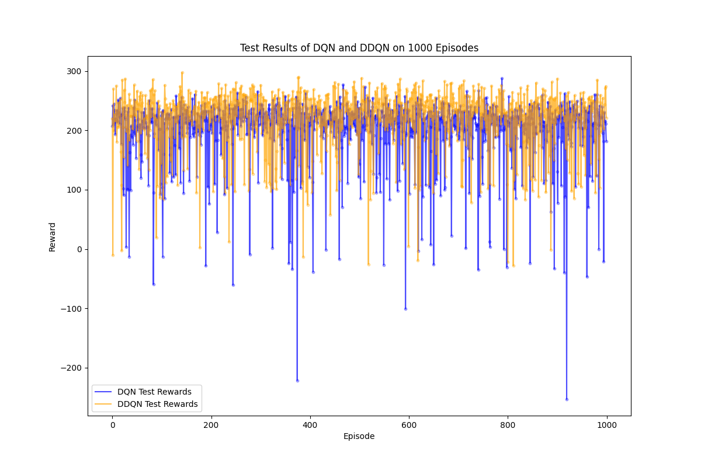

**Key Insights:**
- Both algorithms exhibit variability in per-episode rewards, typical in reinforcement learning.
- Double DQN shows a higher concentration of points in the upper reward range.
- While both have occasional low-reward episodes, these appear less frequent for Double DQN.

#### Reward Distribution
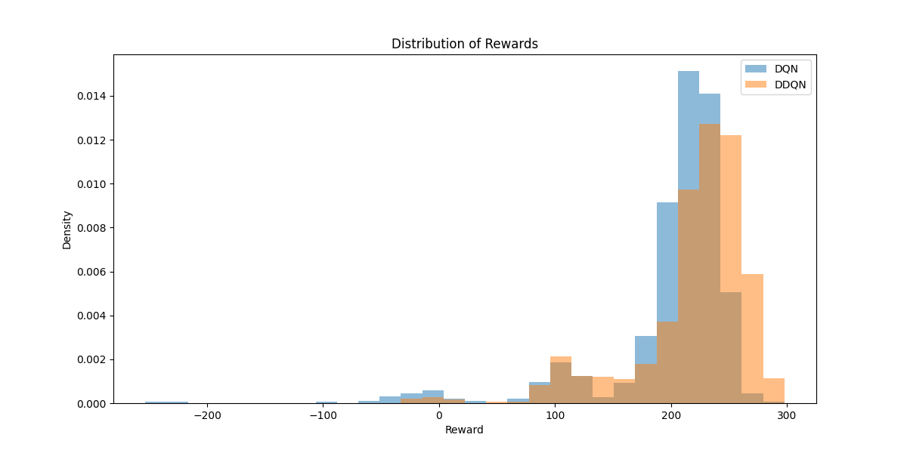

**Key Insights:**
- Both show bimodal, right-skewed distributions, indicating frequent high rewards.
- Double DQN's main peak is shifted slightly to the right indicating higher average rewards.
- DQN has a slightly higher density in the low-reward region.

### Conclusion

While both DQN and Double DQN successfully solved the Lunar Lander environment, Double DQN demonstrates superior performance across multiple metrics:
1. More stable rolling average rewards
2. Faster accumulation of cumulative rewards
3. More consistent high-reward episodes
4. A tighter distribution of rewards skewed towards higher values

These results suggest that Double DQN not only solves the environment but does so with greater efficiency and reliability compared to standard DQN. This performance difference is likely due to Double DQN's improved action-value estimation, which leads to more accurate and stable learning.

### Comparison of Networks after Full Training (4000 Episodes)

After completing 4000 training episodes, I evaluated both networks over 1000 test episodes to assess their final performance and compare the impact of extended training.

**Important Test Conditions:**
- Exploration was set to zero (ε = 0)
- Only the greedy action was selected for each state
- The test ran for 1000 episodes

These conditions allow us to evaluate the true learned policy of each network without the influence of random exploratory actions. By using only greedy actions, we can assess how well each network has learned to make optimal decisions in the Lunar Lander environment.

#### Rolling Average Rewards
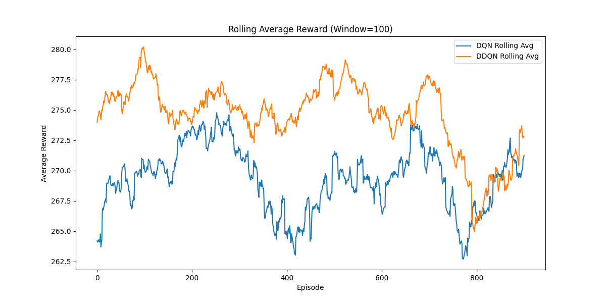

**Key Insights:**
- Both algorithms show significantly improved and more stable performance compared to the solving point.
- The performance gap between DQN and Double DQN has narrowed, with Double DQN maintaining a slight edge.
- Both consistently maintain average rewards well above 250, indicating highly effective policies.

#### Cumulative Rewards
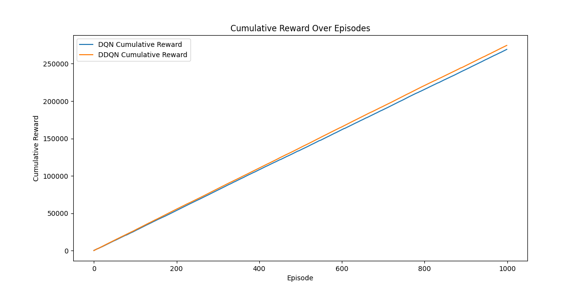

**Key Insights:**
- DQN and Double DQN show very similar cumulative reward curves, indicating comparable performance.
- Both demonstrate steady, almost linear increase in cumulative reward, suggesting consistent high performance.
- Double DQN still accumulates slightly higher total reward, but the difference is less pronounced.

#### Per-Episode Rewards
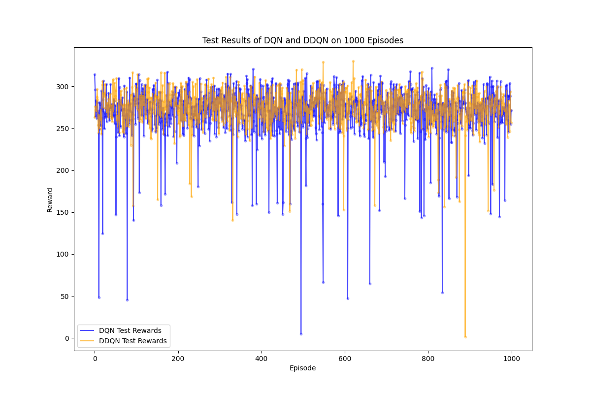

**Key Insights:**
- Significant upward shift in rewards for both algorithms, with most episodes achieving above 200.
- Reduced variability in rewards, indicating more consistent performance across episodes.
- Both algorithms frequently achieve rewards close to or above 300, and no longer fall to scores bellow 0, demonstrating highly optimized policies.

#### Reward Distribution
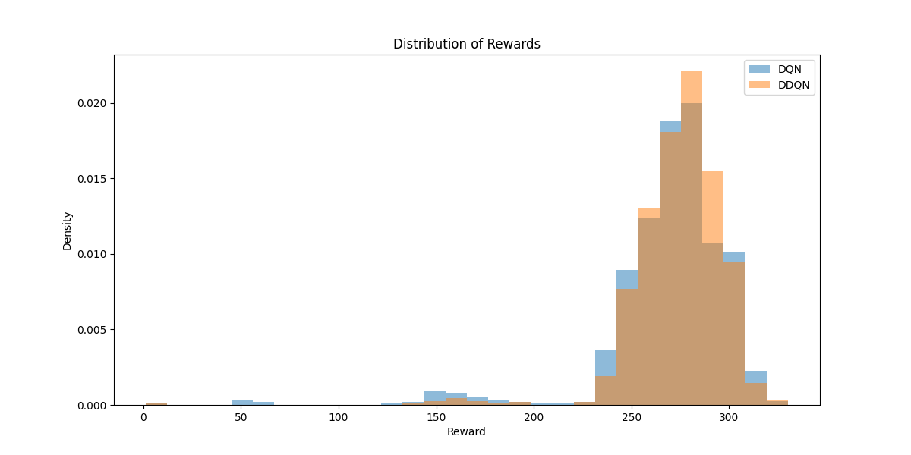

**Key Insights:**
- Both distributions have shifted significantly to the right, indicating higher overall rewards.
- Narrower and taller peaks suggest more consistent performance with less variability.
- Very low density in lower reward regions for both algorithms, indicating rare poor performances.
- Double DQN maintains a slight rightward shift, suggesting a small persistent advantage.

### Conclusion

Extended training to 4000 episodes has significantly improved the performance of both DQN and Double DQN:

1. Both algorithms now demonstrate remarkably stable and high-performing policies.
2. The initial performance gap between DQN and Double DQN has narrowed considerably.
3. DQN has shown substantial improvement, nearly matching Double DQN's performance.
4. Double DQN maintains a slight edge across all metrics, but the difference is much less pronounced.

These results suggest that with sufficient training time, both algorithms can achieve similar levels of high performance in the Lunar Lander environment. However, Double DQN's persistent slight advantage indicates that it may still be the preferable choice for faster convergence and marginally better final performance.

### Discussion 
In this section, I'll summarize and interpret the key findings from the comparative analysis of DQN and Double DQN algorithms in the Lunar Lander environment. This discussion will highlight the main differences in performance, efficiency, and stability between the two approaches.

#### DQN vs Double DQN Performance in Lunar Lander

The comprehensive analysis of DQN and Double DQN algorithms in the Lunar Lander environment reveals several key insights:

1. **Learning Efficiency:**
   - Double DQN consistently demonstrated faster learning and reached the solving threshold (average reward of 200 over 100 episodes) more quickly than DQN across multiple runs.
   - The learning curves showed that Double DQN maintained a slight but consistent advantage throughout the training process.

2. **Performance at Solving Point:**
   - Immediately after solving the environment, Double DQN showed superior performance with higher average rewards, more consistent high-reward episodes, and a tighter reward distribution.
   - This indicates that Double DQN not only solves the environment faster but also achieves a more robust policy at the point of solving.

3. **Full Training Results (4000 episodes):**
   - Both DQN and Double DQN significantly improved their performance with extended training, achieving consistently high rewards.
   - The performance gap between DQN and Double DQN narrowed considerably, with DQN catching up to Double DQN's level of performance.
   - Double DQN maintained a slight edge in terms of average reward and consistency, but the difference became much less pronounced.

4. **Stability and Optimization:**
   - After full training, both algorithms demonstrated highly optimized and stable policies, consistently achieving rewards well above the solving threshold.
   - The reward distributions for both algorithms became narrower and shifted towards higher values, indicating more consistent high-level performance.

5. **Practical Implications:**
   - Double DQN appears to be the better choice when training resources are limited or when quick convergence to a good policy is required.
   - For scenarios where extended training is possible, both algorithms can achieve similar levels of high performance, with Double DQN maintaining a slight advantage.

6. **Algorithm Design Impact:**
   - The consistent, albeit sometimes small, advantage of Double DQN across various stages of training and evaluation metrics suggests that its design to reduce overestimation bias in Q-value estimates is effective in the Lunar Lander environment.

These results highlight the trade-offs between learning speed and asymptotic performance in reinforcement learning algorithms. While Double DQN offers clear advantages in terms of learning efficiency and early performance, standard DQN can achieve comparable results with sufficient training time. The choice between DQN and Double DQN for similar tasks may depend on factors such as available computational resources, the need for early performance gains, and the specific characteristics of the target environment.

## References
This was a project started during the Udemy course:
- Artificial Intelligence A-Z 2024: Build 7 AI + LLM & ChatGPT 
   - Created by Hadelin de Ponteves, Kirill Eremenko, SuperDataScience Team, Luka Anicin and the Ligency Team
   - https://www.udemy.com/share/101Wpy3@8EUG1WmSHuIQ8NJ8MqbUIKERQL-i115amp8Wv-vEns_QefgYHXhNbCiRxagVIsqkvA==/

I would also like to thank:

- David R. Pugh for his insightful blog post on implementing Double DQN, which provided valuable reference and inspiration for this project:

   - "Improving the DQN algorithm using Double Q-Learning" (April 11, 2020)
   - https://davidrpugh.github.io/stochastic-expatriate-descent/pytorch/deep-reinforcement-learning/deep-q-networks/2020/04/11/double-dqn.html

## Setup Instructions

### Prerequisites

Before you begin, ensure you have Conda installed on your machine. If you do not have Conda installed, please follow the installation instructions on the [official Conda documentation](https://docs.conda.io/projects/conda/en/latest/user-guide/install/index.html).

### Steps to Set Up the Environment

1. **Clone the Repository**:
   First, clone the repository to your local machine using Git:
   <!-- ```bash -->
   git clone [repository-url]
   cd [repository-name]
   <!-- ``` bash -->
   Replace `[repository-url]` and `[repository-name]` with the actual URL and name of the Git repository.

2. **Create the Conda Environment**:
   Create the Conda environment using the `DQL_environment.yml` file included in the repository:
   <!-- ```bash -->
   conda env create -f DQL_environment.yml
   <!-- ``` -->
   This command reads the `DQL_environment.yml` file in the repository, which contains all the necessary package dependencies and settings, and creates a Conda environment based on it.

3. **Activate the Conda Environment**:
   Once the environment is created, you can activate it using the following command:
   <!-- ```bash -->
   conda activate DQL_environment
   <!-- ``` -->

4. **Launch Jupyter Notebook**:
   After activating the environment, you can start the Jupyter Notebook server:
   <!-- ```bash -->
   jupyter notebook
   <!-- ``` -->
   This command launches Jupyter Notebook, and you should be able to open and run the notebooks in the browser.

### Using the Environment

With the environment set up and activated, you are now ready to run the project's notebooks. These notebooks are pre-configured to use the packages and settings defined in the `DQL_environment.yml` file, ensuring compatibility and reproducibility of the results.

#### Running the Notebooks

To run the notebooks, follow these steps:

1. **Navigate to the Project Directory**:
   Make sure you are in the project directory where the notebooks are located.

2. **Start Jupyter Notebook**:
   Use the following command to start Jupyter Notebook:
   <!-- ```bash -->
   jupyter notebook
   <!-- ``` -->
   This will open the Jupyter Notebook interface in your default web browser.

3. **Open a Notebook**:
   In the Jupyter Notebook interface, navigate to the notebook you want to run (e.g., `DQN_LunarLander.ipynb` or `DoubleDQN_LunarLander.ipynb`) and click on it to open.

4. **Run the Notebook**:
   Once the notebook is open, you can run the cells sequentially by clicking on each cell and pressing `Shift + Enter`. Alternatively, you can use the "Run All" option under the "Cell" menu to execute all cells at once.

### Evaluating the Results

After running the notebooks, you can evaluate the performance of the DQN and Double DQN agents based on the generated plots and metrics. The results section in the notebooks will provide detailed insights into the training progress and final performance of the agents.

## Troubleshooting

If you encounter any issues during the setup or while running the notebooks, here are some common troubleshooting steps:

1. **Ensure Correct Conda Environment**:
   Make sure that you have activated the correct Conda environment using:
```bash
conda activate DQL_environment
```*
2. **Check Package Versions**:
   Verify that the package versions in the `DQL_environment.yml` file match the versions installed in your environment. You can list the installed packages using:
```bash
conda list
```

3. **Recreate the Environment**:
   If you encounter dependency issues, try recreating the Conda environment:
   
```bash
conda env remove -n DQL_environment
conda env create -f DQL_environment.yml
```

4. **Consult Documentation**:
   Refer to the documentation of the packages used (e.g., Gymnasium, TensorFlow/PyTorch) for specific issues related to those libraries.

5. **Seek Help**:
   If you are unable to resolve the issue, you can seek help by creating an issue on the project's GitHub repository or by reaching out to the community forums of the respective libraries.


   